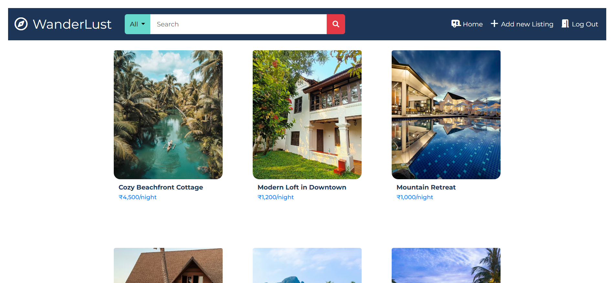
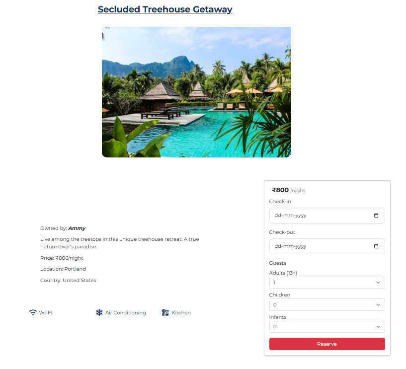
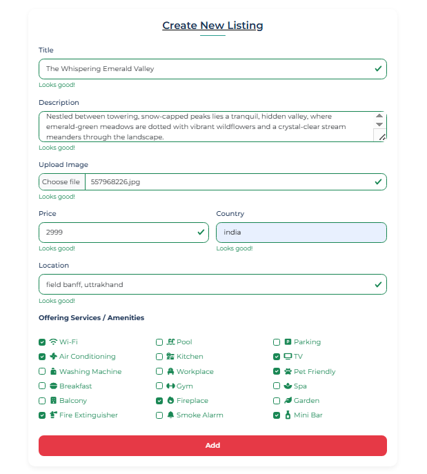
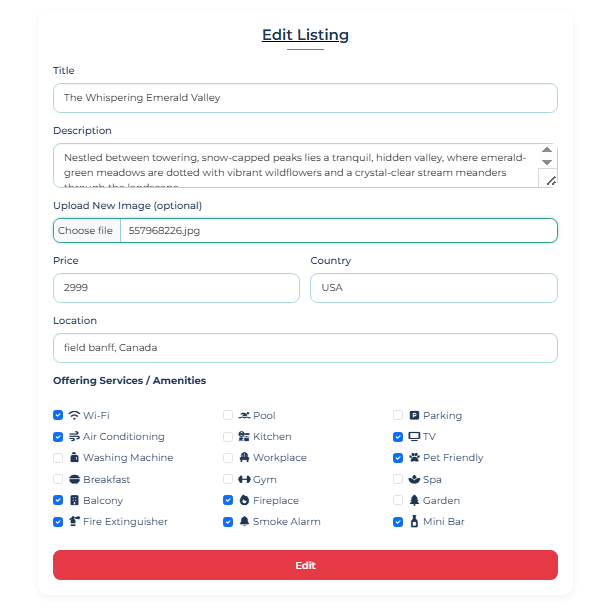
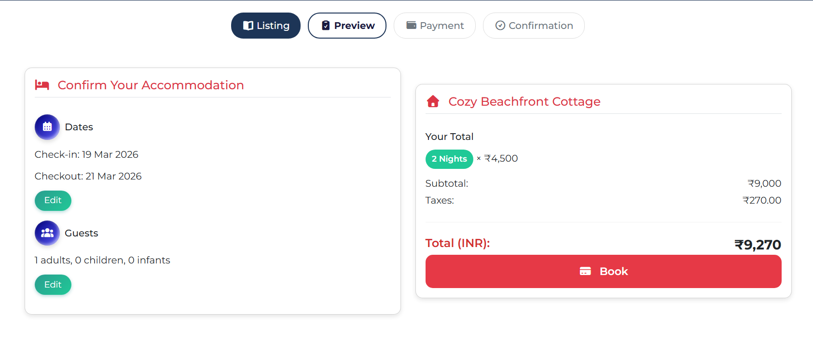
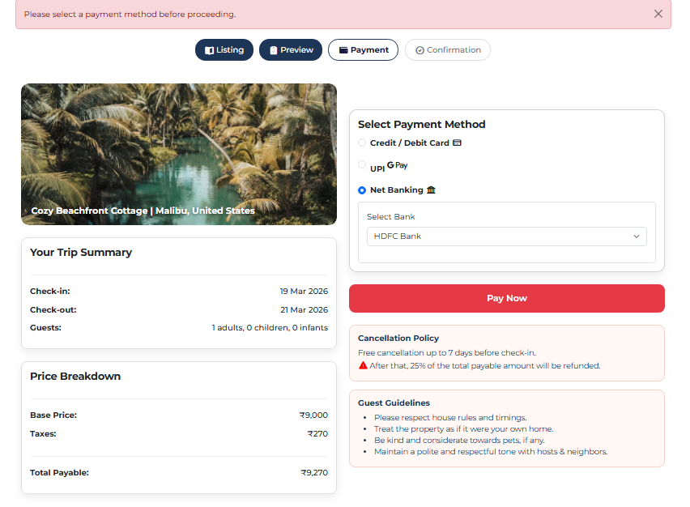
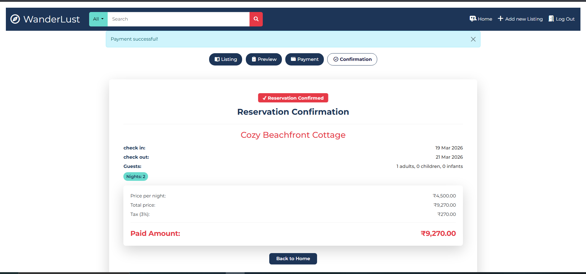

# 🏡 WanderLust - Airbnb Clone

A full-stack web application inspired by Airbnb where users can create, edit, and explore property listings with images, reviews, and amenities.

---

## 🚀 Features

* 🔐 User Authentication (Login/Signup)
* 🏠 Create, Edit, Delete Listings (CRUD)
* 📸 Image Upload using Multer
* ⭐ Reviews & Ratings System
* 🛠️ Amenities Selection
* 💬 Flash Messages for user feedback

---
## 📅 Reservation & Booking System

Implemented a complete multi-step booking workflow:

1. **Booking Summary Page**
   - Displays selected listing details
   - Shows total price including taxes
   - Allows user to review and edit before proceeding

2. **Payment Page (UI Simulation)**
   - Multiple payment options (UPI, Net Banking, Credit/Debit Card)
   - Designed to mimic real-world payment systems

3. **Confirmation Page**
   - Displays booking success message
   - Provides navigation back to home page

⚠️ Note: Payment gateway is simulated (UI only), but the system is designed to support real integration like Stripe or Razorpay.
---
## 🛠️ Tech Stack

* **Frontend:** EJS, Bootstrap
* **Backend:** Node.js, Express.js
* **Database:** MongoDB (Mongoose)
* **Authentication:** Passport.js
* **File Upload:** Multer

---

## 📂 Project Structure

```
.MAJORPROJECT/
├── controllers/
│   ├── listing.js
│   ├── reservation.js
│   ├── review.js
│   └── user.js
│
├── models/
│   ├── listing.js
│   ├── reservation.js
│   ├── review.js
│   └── user.js
│
├── routes/
│   ├── listing.js
│   ├── review.js
│   ├── reservation.js
│   └── user.js
│
├── views/
│   ├── layouts/
│   ├── listings/
│   ├── reservations/
│   ├── users/
│   └── includes/
│
├── public/
│   ├── css/
│   ├── js/
│   └── uploads/
│
├── utils/
│   └── wrapAsync.js
│
├── config/ (rename from init)
│
├── app.js
├── middleware.js
├── schema.js
├── package.json
├── README.md
├── .gitignore
└── .env (not pushed)

```

---

## ⚙️ Installation & Setup

1. Clone the repository:

```bash
git clone https://github.com/Anjali-990/wanderlust.git
cd wanderlust
```

2. Install dependencies:

```bash
npm install
```

3. Setup environment variables:
   Create a `.env` file and add:

```
MONGO_URL=mongodb://127.0.0.1:27017/wanderlust
SESSION_SECRET=your_secret_key
```

4. Run the project:

```bash
node app.js
```

or

```bash
nodemon app.js
```

5. Open in browser:

```
http://localhost:8080
```

---

## 📸 Screenshots

### 🏠 Listings Page


### 📄 Listing Details


### ➕ Create/Edit Listing



### 📅 Booking Summary


### 💳 Payment Page


### ✅ Confirmation Page


---

## ✨ Future Improvements

* 🔍 Search & Filter Listings
* 🗺️ Map Integration (Mapbox)
* 💳 Payment Gateway Integration (Stripe/Razorpay)
* 📍 Location-based Listings
* ❤️ Wishlist Feature
* 📱 Responsive UI improvements

---

## 👩‍💻 Author

* Anjali Sharma

---

## 📌 Note

This project is built for learning purposes and demonstrates full-stack development using Node.js and MongoDB.
